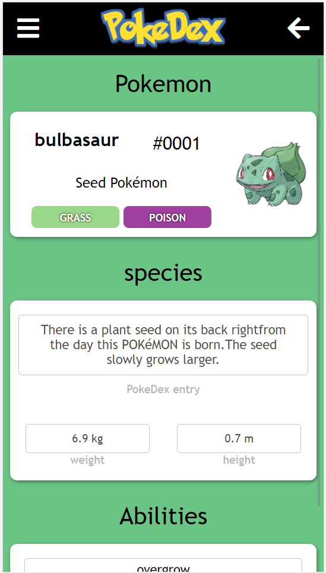

# PokeDex

Mobile App. Pokedex designed to catalogue and provide information regarding the various species of Pokémon featured in the Pokémon video game.

## Built With

- Javascript
- React
- webpack

## Live Demo

[Live Demo Link](https://adoring-curran-fd1e41.netlify.app/)

## Getting Started

- First clone the project by running `git clone https://github.com/sjcco/bookstore`.
- navigate to project folder using `cd`.
- Run `npm install` to install the needed dependencies.
- Run `npm start` to open in browser.
- to display pokemons select type in filter then close the filter for them to display.

## Authors

👤 **Author1**

- GitHub: [@sjcco](https://github.com/githubhandle)
- Twitter: [@CarlosCamposO](https://twitter.com/twitterhandle)
- LinkedIn: [jcarlos-campos](https://linkedin.com/jcarlos-campos)

## 🤝 Contributing

Contributions, issues, and feature requests are welcome!

Feel free to check the [issues page](http://github.com/sjcco/bookstore/issues/).

## Show your support

Give a ⭐️ if you like this project!

## Acknowledgments

- Hat tip to anyone whose code was used
- microverse team

## 📝 License